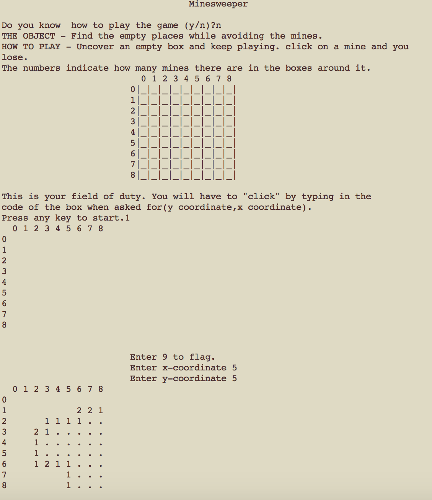
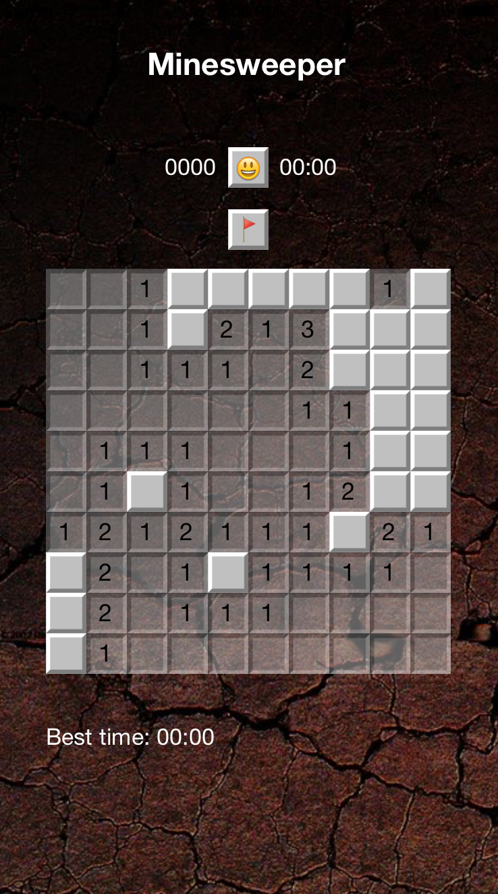

TurboMineSweeper
================

Mid semester high school project that uses a depth first outward expansion algorithm (discovered a completely unknown fact about recursion at the time!) to play a game of minesweeper with a 9X9 mine map. 

Named "TurboMineSweeper" to show the fact that this project was initially programmed in the compiler cum IDE known as Turbo C++ (MS-DOS) (:D)

 
  
With an ios version of the app, the game now looks like

######How to run
Compile with the line "g++ MinesweeperProject.cpp" and then run the executable to play the game!

 
**Creator:** Aaryaman Sagar
